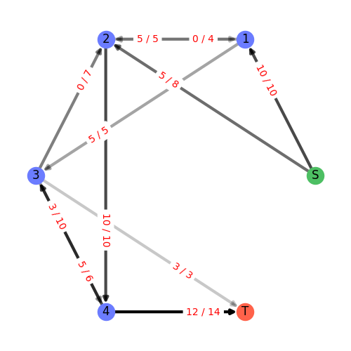
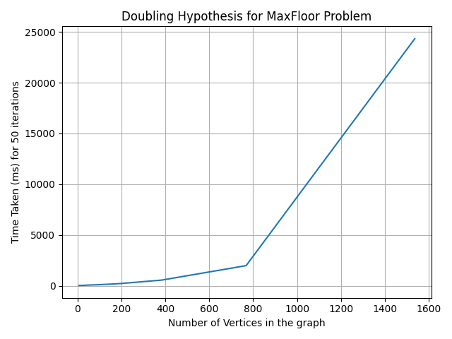

# Max Flow Problem Using Ford-Fulkerson Algorithm

# Setup project locally
#### Dependencies
- Python 3.8+ (this won't work on lower version of python)
- PIP
- networkx
- tabulate
- matplotlib

#### File Structure
```bash
├── benchmark.py        # Runs the benchmark tests
├── generate_dataset.py # scale the sample_dataset 8 times by 2
├── gui.py              # GUI Class
├── main.py             # Run the max flow on customm graph
├── network.py          # Network Class and the Edge class
├── README.md
├── requirements.txt    # Python requirements
└── sample_dataset      # Sample Data Set
```
#### How to Run
```shell script
pip3 install -r requirements.txt
python3 main.py
```
> Note - If you are using windows remove '3' from pip and python

## Algorithmic Approach

### Algorithmic strategy

Maximum flow problem is a problem where we have to find the maximum number of flow units that can be passed from the source node to sink node given different flow paths.

I used the ford-fulkerson algorithm to calculate maximum flow from the given graph.

The Ford-fulkerson algorithm needs a searching algorithm to find all augmenting paths in a given network and it&#39;s up to the user to implement this to have flexibility.

So for that I used depth first search (using recursion technique) for finding augmenting paths in the graph.

So to find the maximum flow we need calculate all the bottleneck (minimum cut) value of all the augmenting paths and sum them up and that the maximum flow of the graph

### Data structures and its traversal towards solution

I my solution I have 3 main data structures,

1. defaultdict - it&#39;s python dictionary (hashmap in java world) which comes default value each time we add new key
2. Edge - this is custom class I implement hold the data about given edge (source, destination, capacity, etc)
3. List - it&#39;s mutable array I which I can add and remove values at will

**Reason for using defaultdict**

I mainly used this because I created a script to scale the graph so I wanted added nodes at free will without having a predefined size of the network.

The difference between defaultdict and python dictionary is I can specify the default value for every key so when I am adding edges I don&#39;t need to check if that key exists and if not initialize a List as the value and append the destination of the edge. I can easily just call self.graph[source].append(edge) and it won&#39;t though a null pointer exception

**Reason for using Edge**

This custom data structure holds all the data about a given edge as well as a pointer to the residual edge of the given edge so we can update flow of residual edge from the forward edge. It also make it easy to get the remaining capacity of given edge just using class method

**Reason for using List**

One node on the graph can have many edges, So I combined defaultdict with a list so I can add node as the key and have a list of all the edges

```bash
 [{0: [Edge 0 ->; 1 = 10, Edge 0 ->; 2 = 8]},
  {1: [Edge 1 ->; 0 = 0, Edge 1 ->; 2 = 5, Edge 1 ->; 2 = 0, Edge 1 ->; 3 = 5]},
  {2: [Edge 2 ->; 0 = 0, Edge 2 ->; 1 = 0, Edge 2 ->; 1 = 4, Edge 2 ->; 4 = 10, Edge 2 ->; 3 = 0]},
  {3: [Edge 3 ->; 1 = 0, Edge 3 ->; 2 = 7, Edge 3 ->; 4 = 6, Edge 3 ->; 4 = 0, Edge 3 ->; 5 = 3]},
  {4: [Edge 4 ->; 2 = 0, Edge 4 ->; 3 = 0, Edge 4 ->; 3 = 10, Edge 4 ->; 5 = 14]},
  {5: [Edge 5 ->; 3 = 0, Edge 5 ->; 4 = 0]} ]
```
> Note - The diagram below show case how the graph is represented in side python using all 3 data  structures I have mentioned above

### Pseudo-code
1. Define the size of the network and indexes of source and sink nodes
2. Initialize the network with all the edges and their capacities
3. Initialize variable to hold the max\_flow value
4. Find a path between source and sink node that don&#39;t have recursion (don&#39;t go through same edge twice) and don&#39;t contain a edge that has reached the full capacity
5. For all the edges in the given path find the edge with minimum remaining capacity (capacity of edge - flow value of the edge)
6. Add the minimum remaining capacity max\_flow variable
7. Add the minimum remaining capacity to flow value of every edge in that path
8. subtract the minimum remaining capacity from all residual edge of edges in that path
9. Repeat 3,4,5,6 till there are no more augmenting (alternative) paths in the network
10. When there is no more augmenting paths the value of the variable max\_flow maximum flow of the network

|                                                   |                                                                                  |
| :-----------------------------------------------: |:--------------------------------------------------------------------------------:|
|||
| **Initial Graph**                                 | **After the max flow calculation**                                               | 


## Performance analysing

I created the script that scale given N times by the factor of M. I gave the sample graph specified in the coursework spec and that script managed to scale that graph up to vertices-1536 and edges-2816 and while creating 9 graphs.

```
|    N |     Time | Ratio   | Lg Ratio   |   Max Flow |   Edges |   O(Max Flow * Edges) |
|------+----------+---------+------------+------------+---------+-----------------------|
|    7 |    20.26 | -       | -          |         15 |      11 |                   165 |
|   12 |    18.44 | 0.91    | -0.14      |         18 |      22 |                   396 |
|   24 |    30.75 | 1.67    | 0.74       |         34 |      44 |                  1496 |
|   47 |    59.18 | 1.92    | 0.94       |         36 |      88 |                  3168 |
|   96 |    96.05 | 1.62    | 0.7        |         36 |     176 |                  6336 |
|  192 |   203.54 | 2.12    | 1.08       |         79 |     352 |                 27808 |
|  384 |   552.96 | 2.72    | 1.44       |         86 |     704 |                 60544 |
|  768 |  1977.33 | 3.58    | 1.84       |        173 |    1408 |                243584 |
| 1536 | 24329.2  | 12.3    | 3.62       |        794 |    2816 |               2235904 |
```
*Raw data outputted from benchmark.py*


 

*Visualization of that Time Complexity*

## Conclusions

This algorithm finds all augmenting paths in the network and using depth first search and add the constant amount of flow units (bottleneck value) in each edge in that path and repeat it till there are no more augmenting paths. So order of growth for Ford-Fulkerson Algorithm in the worst case loop tough every edge in the network and add one flow unit every time till the max flow was reached which means `O(Number_of_Edges * Max_Flow)`

## References
- https://www.geeksforgeeks.org/ford-fulkerson-algorithm-for-maximum-flow-problem/
- https://www.youtube.com/watch?v=Iwc3Uj4aaF4
- https://www.youtube.com/watch?v=LdOnanfc5TM
- https://www.youtube.com/watch?v=Xu8jjJnwvxE
- https://github.com/williamfiset/Algorithms